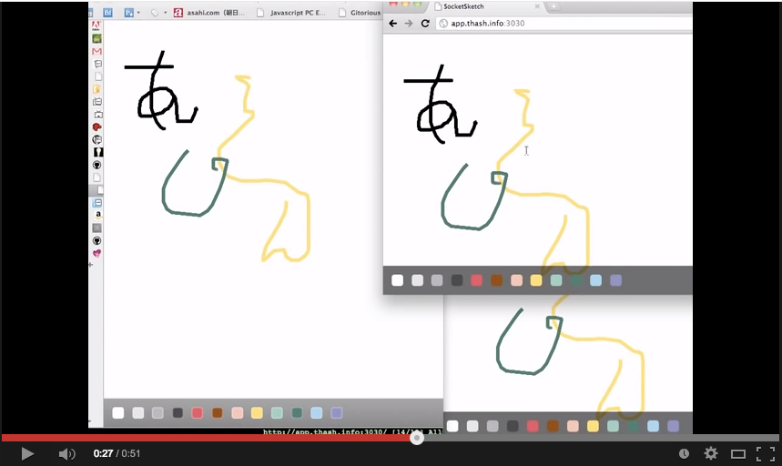

# sketch-node
Prototype of realtime multi-user drawing tool using Node.js.

[Node.jsとWebSocketとHTML5のcanvasでお絵描き共有 - YouTube](https://www.youtube.com/watch?v=XedaO3xQsz0)

[HTML5のcanvas+Node.js+WebSocketでリアルタイムお絵描き共有アプリを作ったよ : ミームの死骸を越えてゆけ](http://blog.livedoor.jp/memerelics/archives/3207042.html)
